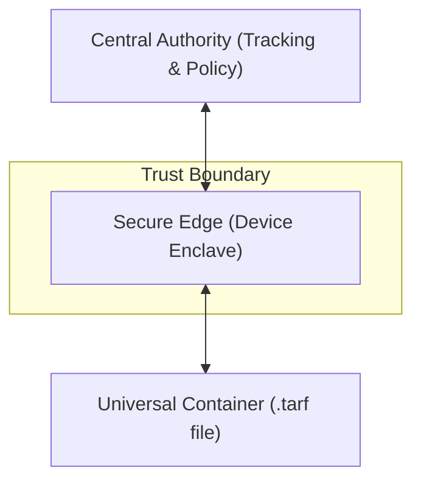

# Three-Tier Security Model

Tarf operates on a decentralized, multi-tiered architecture that separates policy enforcement from cryptographic execution. This "Three-Tier" design ensures that even a breach in one layer does not compromise the security or privacy of the entire system.

---

## Overview

The architecture is composed of three distinct logical entities, each with a specific responsibility:

1.  **The Central Authority** (Verification & Genealogy)
2.  **The Secure Edge** (Local Enclave Execution)
3.  **The Universal Container** (Portable Encrypted Assets)

---

## Tier 1: The Central Authority

The **Central Authority** acts as the brain of the network. It does not store or process your files; instead, it manages the **trust registry**.

### Role & Responsibilities
- **Identity Issuance**: Generating the root identities for new assets.
- **Policy Management**: Defining who can access which file, for how long, and under what conditions.
- **Genealogy Tracking**: Maintaining the "Index" of how files have branched through sharing and forking.
- **Revocation Broadcast**: Instantly invalidating specific lineages or devices globally.

### Security Posture
The Central Authority is **content-agnostic**. It only sees cryptographic hashes and lineage metadata. It never holds the decryption keys for the assets it tracks.

---

## Tier 2: The Secure Edge

The **Secure Edge** is the local execution environment where the actual cryptographic heavy lifting happens. It is the only place where the asset is ever decrypted.

### Role & Responsibilities
- **Local Minting**: Transforming raw content into a Secure Container.
- **Enclave Execution**: Performing "Rolling Key" rotations within a protected memory space.
- **Hardware Binding**: Fingerprinting the local machine to ensure the file is running in an authorized environment.
- **Policy Enforcement**: Locally verifying timing, usage limits, and revocation status before granting access.

### Security Posture
The Secure Edge uses **Hardware-Locked RAM Protection**. Even the user themselves cannot easily extract the keys from the secure process memory while the file is being "rolled."

---

## Tier 3: The Universal Container

The **Universal Container** is the data format that makes assets portable yet secure. It is the physical manifestation of the protected file.

### Role & Responsibilities
- **Encrypted Payload**: Carrying the content in a high-performance, streamable encrypted state.
- **Cryptographic Header**: Encapsulating the current "Wrapped Key" and the lineage metadata required for the next rotation.
- **Embedded Integrity**: Ensuring the file cannot be tampered with or modified without detection.

### Security Posture
The container is essentially a "black box" that can only be opened by a valid "Secure Edge" instance authorized by the "Central Authority."
